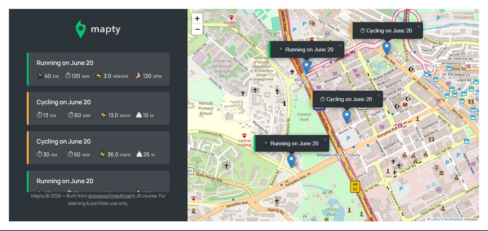

# Mapty - Map Your Workouts 🗺️

A workout tracking web app that plots your **running** and **cycling** sessions on an interactive map using your real GPS location. Log workouts, view stats, and have everything automatically saved across browser sessions.

---

## Live Demo

🔗 [mapty-prlemayian.netlify.app](#)

---

## Preview



---

## Features

- **Geolocation**: Automatically detects your current position and centres the map on it
- **Interactive map**: Powered by [Leaflet.js](https://leafletjs.com/) and [OpenStreetMap](https://www.openstreetmap.org/) - click anywhere to log a workout at that location
- **Running workouts**: Track distance, duration, and cadence - pace (min/km) is calculated automatically
- **Cycling workouts**: Track distance, duration, and elevation gain - speed (km/h) is calculated automatically
- **Map markers**: Each workout is pinned with a custom popup on the map
- **Workout list**: All workouts appear in the sidebar - click one to fly the map to that pin
- **Persistent storage**: Workouts are saved to `localStorage` and restored on every page load, no login required

---

## How to Use

1. Open the app and it will ask for your location. **Allow it.**
2. Click anywhere on the map where the workout took place.
3. Fill in the workout form that appears on the left:
   - Choose **Running** or **Cycling** from the dropdown
   - Enter **distance** (km), **duration** (min), and either **cadence** (steps per minute) or **elevation gain** (m)
4. Press **Enter** to submit - the workout is pinned on the map and added to the list.
5. Click any workout in the sidebar list to pan and zoom the map to that pin.
6. Your workouts persist across sessions automatically via `localStorage`.

---

## Installation & Setup

No build tools or package manager required - this runs straight in the browser.

```bash
# 1. Clone the repository
git clone https://github.com/PrinceLemayian/mapty.git

# 2. Open the project folder
cd mapty

# 3. Serve it locally (pick any option)
npx live-server          # using live-server
# OR open index.html directly in your browser
```

> **Note:** Opening `index.html` as a `file://` URL may block location access in some browsers since geolocation requires the page to be served over `http://` or `https://`. Use `live-server` or deploy to Netlify/GitHub Pages.

---

## Project Architecture

Mapty is built with **vanilla JavaScript (ES6+)** using an OOP design pattern centred on three classes.

### Class Hierarchy

```
Workout (base class)
├── Running
└── Cycling

App (orchestrator)
```

---

### `Workout` — Base Class

Holds all the shared state and behaviour for any workout type.

| Property      | Type         | Description                                                      |
| ------------- | ------------ | ---------------------------------------------------------------- |
| `date`        | `Date`       | Auto-set to the time the workout was created                     |
| `id`          | `string`     | Last 10 digits of `Date.now()` - unique enough for this use case |
| `coords`      | `[lat, lng]` | Map coordinates where the workout was logged                     |
| `distance`    | `number`     | Distance in km                                                   |
| `duration`    | `number`     | Duration in minutes                                              |
| `description` | `string`     | Auto-generated e.g. `"Running on June 20"`                       |

---

### `Running extends Workout`

```js
new Running(coords, distance, duration, cadence);
```

| Extra property     | How it's set                               |
| ------------------ | ------------------------------------------ |
| `type = 'running'` | Class field (used for UI and description)  |
| `cadence`          | From form input                            |
| `pace`             | Calculated: `duration / distance` (min/km) |

---

### `Cycling extends Workout`

```js
new Cycling(coords, distance, duration, elevationGain);
```

| Extra property     | How it's set                                    |
| ------------------ | ----------------------------------------------- |
| `type = 'cycling'` | Class field                                     |
| `elevationGain`    | From form input                                 |
| `speed`            | Calculated: `distance / (duration / 60)` (km/h) |

---

### `App` - Application Controller

The `App` class wires everything together. It uses **private class fields** (prefixed `#`) so internal state is fully encapsulated.

| Private field   | Purpose                                                       |
| --------------- | ------------------------------------------------------------- |
| `#map`          | The Leaflet map instance                                      |
| `#mapZoomLevel` | Default zoom level (16)                                       |
| `#mapEvent`     | The last map click event (holds coordinates for new workouts) |
| `#workouts`     | Array of all `Running` / `Cycling` instances                  |

**Key methods:**

| Method                          | What it does                                                                 |
| ------------------------------- | ---------------------------------------------------------------------------- |
| `_getPosition()`                | Calls the Geolocation API; passes result to `_loadMap`                       |
| `_loadMap(position)`            | Initialises Leaflet map, binds map click handler, re-renders saved markers   |
| `_showForm(mapE)`               | Stores the click event, reveals the input form                               |
| `_hideForm()`                   | Clears inputs, hides form with a CSS trick to preserve the animation         |
| `_newWorkout(e)`                | Validates form, creates `Running` or `Cycling` object, saves and renders it  |
| `_renderWorkoutMarker(workout)` | Places a Leaflet marker + popup on the map                                   |
| `_renderWorkout(workout)`       | Inserts a workout card into the sidebar list                                 |
| `_moveToPopup(e)`               | Uses event delegation on the list - pans map to the clicked workout's coords |
| `_setLocalStorage()`            | Serialises `#workouts` array to `localStorage` via `JSON.stringify`          |
| `_getLocalStorage()`            | Restores workouts from `localStorage` via `JSON.parse` on app load           |
| `reset()`                       | Clears `localStorage` and reloads the page (call from the console)           |

---

## Data Flow

```
User clicks map
      │
      ▼
#mapEvent stored ──► Form shown
      │
User submits form
      │
      ▼
Input validation
      │
      ├── type === 'running'  ──► new Running(...)
      └── type === 'cycling'  ──► new Cycling(...)
                                        │
                          ┌─────────────┼─────────────┐
                          ▼             ▼             ▼
                    Push to         Render         Render
                   #workouts        marker          list
                          │
                          ▼
                   _setLocalStorage()
                   (JSON.stringify → localStorage)
```

---

## localStorage Integration

Workouts are persisted using the browser's `localStorage` API:

```js
// Saving (called after every new workout)
_setLocalStorage() {
  localStorage.setItem('workouts', JSON.stringify(this.#workouts));
}

// Restoring (called once in the constructor)
_getLocalStorage() {
  const data = JSON.parse(localStorage.getItem('workouts'));
  if (!data) return;

  this.#workouts = data;
  this.#workouts.forEach(work => this._renderWorkout(work));
}
```

---

## Technologies

| Technology                                      | Role                               |
| ----------------------------------------------- | ---------------------------------- |
| HTML5 / CSS3                                    | UI structure and styling           |
| Vanilla JavaScript (ES6+)                       | App logic, OOP, DOM manipulation   |
| [Leaflet.js](https://leafletjs.com/)            | Interactive map rendering          |
| [OpenStreetMap](https://www.openstreetmap.org/) | Map tile provider                  |
| Geolocation API                                 | Getting the user's GPS coordinates |
| localStorage API                                | Client-side data persistence       |

---

## Known Limitations

- Restored workouts lose their prototype chain - prototype methods are unavailable after page reload
- No ability to edit or delete individual workouts from the UI (use `app.reset()` in the browser console to wipe all data)
- Map markers are not restored after reload if the map hasn't finished loading - handled by calling `_renderWorkoutMarker` inside `_loadMap` after the map is ready
- No backend or user accounts - all data is local to the browser

---

## What I Learned

- Designing an OOP architecture with inheritance (`Workout → Running / Cycling`)
- Using **private class fields** (`#`) for proper encapsulation
- Integrating a third-party map library (Leaflet.js) with vanilla JS
- Working with the **Geolocation API** and its asynchronous callback pattern
- Managing application state across async events (geolocation, map clicks, form submission)
- Persisting and restoring structured data with `localStorage` + `JSON.stringify`/`JSON.parse`
- The prototype chain quirk when serialising class instances to JSON

---

## Author

**Lemayian** - [@PrinceLemayian](https://github.com/PrinceLemayian)

---

## Acknowledgements

Course and project design by [Jonas Schmedtmann](https://github.com/jonasschmedtmann) - [The Complete JavaScript Course](https://www.udemy.com/course/the-complete-javascript-course/).
